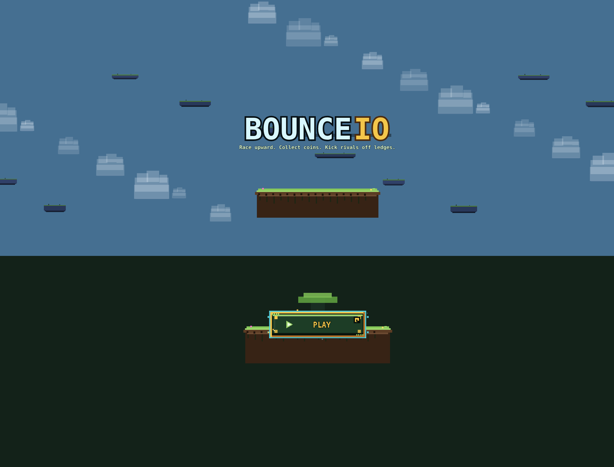
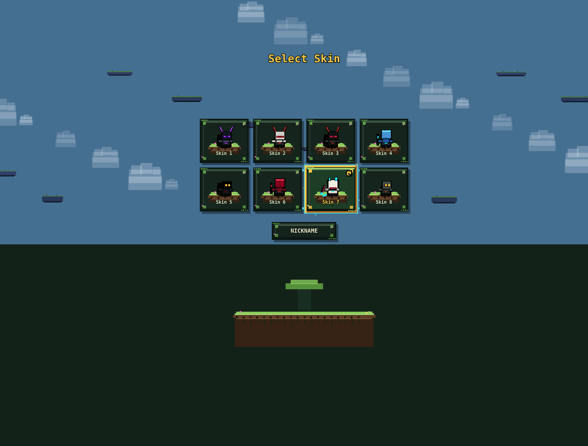
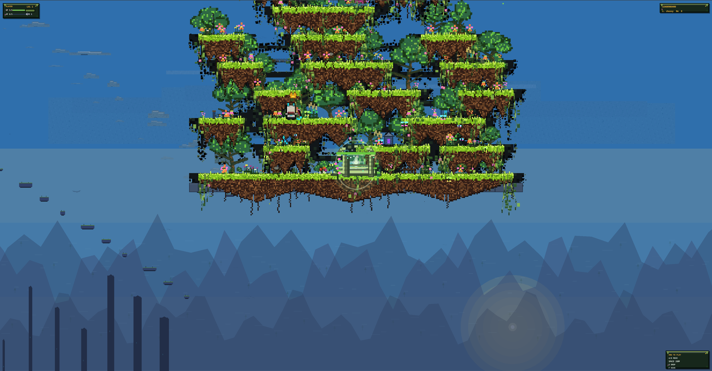
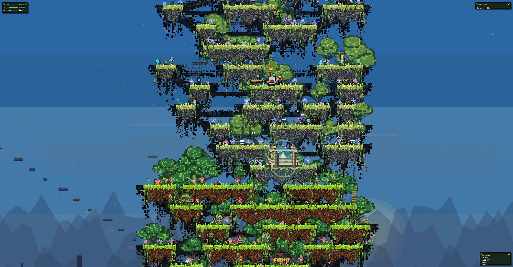

# Bounce IO

**Bounce IO** is a fast browser platformer about racing upward through floating forest ruins. Pick a pixel-art racer, climb procedurally generated islands, grab relics from risky routes, and kick rivals off ledges before they beat you to the summit.

> Live demo: [Play Bounce IO](TODO_LIVE_DEMO_URL)

## Screenshots

| Title Screen | Skin Selection |
| --- | --- |
|  |  |

| Floating Garden | Ancient Ruins |
| --- | --- |
|  |  |

## Game Overview

Every match is a short vertical race for 1-8 players. The world is built from seeded chunks, so everyone climbs the same route while choosing between safer recovery lanes, central race lines, and narrow relic paths. Falling is not the end: checkpoints bring players back to their highest reached chunk, keeping the race tense without stopping the climb.

The first player to reach the exit platform at the top wins. If time runs out, placement is decided by height first and relics second.

## Features

- Competitive vertical racing through floating pixel-art ruins.
- Solo play and multiplayer rooms for up to 8 racers.
- Authoritative server simulation with client-side prediction.
- Procedural chunks with reachability checks for fair climbs.
- Relic collection on higher-risk routes.
- Kick and passive push systems for direct ledge-fighting.
- Checkpoint respawns based on highest reached chunk.
- Animated portals, parallax sky layers, relic bursts, HUD panels, and skin selection.

## Controls

| Key | Action |
| --- | --- |
| `A` / `D` | Move left / right |
| `Space` / `W` | Jump |
| `S` | Drop through one-way platforms |
| `F` | Kick |
| `F1` | Toggle debug overlay |
| `F2` | Force respawn |
| `F3` | Regenerate local world |

## Run Locally

Install dependencies:

```bash
npm install
```

Start the Go multiplayer server:

```bash
npm run dev:server:go
```

In another terminal, start the Vite client:

```bash
npm run dev:client
```

The Vite client runs on `http://localhost:5173` and proxies `/ws` to the local game server on port `8787`.

## Quality Checks

```bash
npm run typecheck
npm test
npm run build
```

## Project Notes

- Game design: [docs/GAME_DESIGN.md](docs/GAME_DESIGN.md)
- Visual direction: [docs/ART_BIBLE.md](docs/ART_BIBLE.md)
- Balance values: [docs/BALANCE_TABLES.md](docs/BALANCE_TABLES.md)
- Platform rules: [docs/PLATFORM_RULES.md](docs/PLATFORM_RULES.md)

## Status

Bounce IO is in active development. The current slice focuses on the full climb loop: movement, procedural vertical worlds, checkpointing, relics, kicking, HUD feedback, and multiplayer synchronization.
